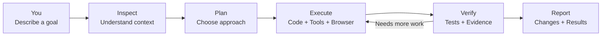
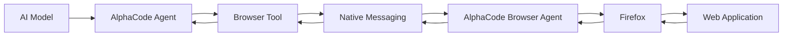
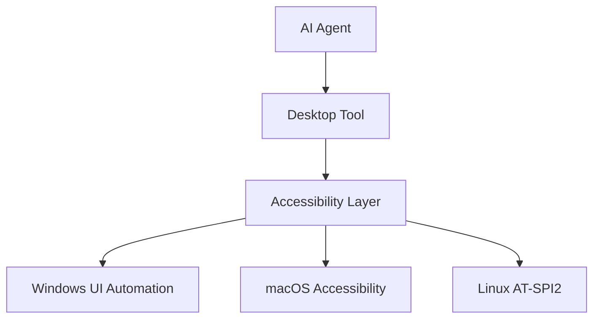
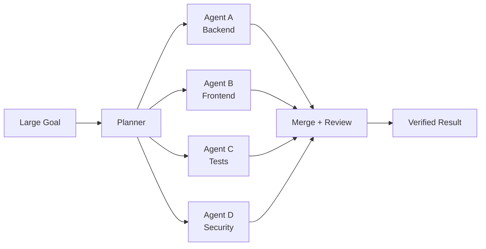

<div align="center">


# AlphaCode

### An open-source AI agent for code, browsers, desktops, and real-world workflows.

<p>
  <strong>Describe the goal. AlphaCode investigates, plans, executes, verifies, and reports.</strong>
</p>

<p>
  <a href="https://github.com/dragonked2/alphacode/releases"></a>
  <a href="https://github.com/dragonked2/alphacode/blob/main/LICENSE"></a>
  <a href="https://github.com/dragonked2/alphacode"></a>
  <a href="https://addons.mozilla.org/en-US/firefox/addon/alphacode-browser-agent/"></a>
</p>

<p>
  
  
  
  
  
</p>

<p>
  <a href="#-what-is-alphacode">What is AlphaCode?</a> ·
  <a href="#-the-browser-agent">Browser Agent</a> ·
  <a href="#-how-the-agent-works">How It Works</a> ·
  <a href="#-install">Install</a> ·
  <a href="#-quick-start">Quick Start</a> ·
  <a href="#-desktop-control">Desktop Control</a> ·
  <a href="#-features">Features</a> ·
  <a href="#-security--privacy">Security & Privacy</a> ·
  <a href="#-configuration">Configuration</a> ·
  <a href="#-troubleshooting">Troubleshooting</a>
</p>

</div>

---

# What is AlphaCode?

**AlphaCode is an open-source, terminal-native AI agent built to do work rather than only generate answers.**

Give AlphaCode a goal in natural language and it can inspect a codebase, understand the surrounding context, plan a solution, edit files, execute commands, run tests, search the web, interact with a real browser, control native desktop applications, coordinate multiple agents, and verify the result.

It turns an AI model from a conversational assistant into an **execution-oriented software agent**.



The core philosophy is simple:

> **Don't just tell the user what should be done. Do the work, verify it, and show the evidence.**

AlphaCode is designed around that principle.

---

# 🌐 The Browser Agent

## Give your AI agent a real browser

Traditional coding agents can read HTML, make HTTP requests, or generate Playwright/Selenium code.

AlphaCode goes further.

With **AlphaCode Browser Agent**, the agent can connect directly to a real Firefox session and operate the browser as part of its workflow.

**The browser becomes another tool available to the agent.**

### Install the official Firefox extension

**AlphaCode Browser Agent is available on Mozilla Add-ons.**

<a href="https://addons.mozilla.org/en-US/firefox/addon/alphacode-browser-agent/">


</a>

The extension is the Firefox execution layer connecting AlphaCode with real browser state, pages, tabs, DOM content, forms, frames, screenshots, downloads, supported cookies, and other browser capabilities. The current AMO release is **1.6.1**.

---

# 🧠 What makes the Browser Agent different?

The browser is not simply a webpage fetcher.

AlphaCode can follow an agent loop such as:

```text
OBSERVE
   ↓
Understand the current browser state
   ↓
LOCATE
   ↓
Find the relevant page, tab, frame, or element
   ↓
ACT
   ↓
Click / type / select / navigate / upload / scroll
   ↓
OBSERVE AGAIN
   ↓
Check what actually changed
   ↓
VERIFY
   ↓
Confirm the expected result
```

That means the agent can react to dynamic websites instead of blindly executing a fixed sequence of commands.

For example:

```text
User:
"Open the local dashboard, find the failing request,
inspect the response, reproduce the issue, and tell me
what is wrong."

AlphaCode:

1. Connects to Firefox
2. Inspects the current tabs
3. Identifies the dashboard
4. Navigates to the relevant page
5. Waits for dynamic content
6. Inspects the DOM
7. Finds the relevant controls
8. Interacts with the application
9. Observes the resulting state
10. Collects evidence
11. Reports the result
```

The important difference is that the agent can **observe the result of its own actions**.

---

# 🧩 Browser Capabilities

The Browser Agent is designed as a broad browser-execution layer.

### Tab and window control

* Open tabs
* Close tabs
* Duplicate tabs
* Reload pages
* Navigate to URLs
* Go backward and forward
* Switch active tabs
* Create and manage browser windows
* Inspect browser and window state
* Control zoom
* Wait for navigation and page changes

### DOM and page intelligence

* CSS selectors
* XPath
* Visible text
* Labels
* Placeholders
* ARIA roles
* Accessible names
* Test IDs
* Element inspection
* Attributes
* Properties
* Computed state
* Interactable-element detection
* Shadow DOM interaction
* Frames and iframes
* Dynamic SPA interfaces

### User interaction

* Click
* Double-click
* Right-click
* Hover
* Focus
* Blur
* Type
* Keyboard input
* Keyboard shortcuts
* Scroll pages
* Scroll individual elements
* Toggle checkboxes
* Toggle radio controls
* Select form options
* Submit forms
* Drag and drop where supported

### Browser state and media

* Browser screenshots
* File-upload workflows
* Download information
* Supported cookie inspection and management
* Session and tab state
* Execution telemetry

The Firefox Add-ons listing documents these capabilities as part of the current extension.

---

# 🔌 How AlphaCode Connects to Firefox

The architecture is intentionally local.



The extension communicates with the locally installed AlphaCode application through **Firefox native messaging** rather than requiring a separate hosted browser automation service.

This makes the browser integration a natural extension of AlphaCode's local agent architecture.

---

# 🛠 What can you build with it?

The Browser Agent is useful anywhere an AI agent needs to interact with an actual web application.

### Software development

```text
"Open the development server and test the login flow."
```

```text
"Check the dashboard after my frontend changes and
verify that the table still works."
```

```text
"Open the application, reproduce the UI bug,
inspect the DOM, and identify the broken component."
```

### Web testing

```text
"Run through the signup flow and report anything that breaks."
```

```text
"Test the form with missing fields and verify the validation."
```

```text
"Check the application at different viewport states."
```

### Debugging

```text
"Open the application and reproduce the issue described in this ticket."
```

```text
"Find the element that is not responding and inspect its state."
```

### Research

```text
"Open these pages, compare the information,
and summarize the differences."
```

### Security testing

When used against systems you are authorized to test, AlphaCode can assist with browser-based security workflows such as:

* Application exploration
* Authentication-flow testing
* Input testing
* DOM inspection
* Form analysis
* Reproduction of browser-visible issues
* Evidence collection
* Multi-step application workflows

**Always use AlphaCode and its browser capabilities only against systems you own or are explicitly authorized to test.**

---

# 🧠 Agentic Browser Workflows

The most important feature is not any individual browser command.

It is the ability to **combine browser actions with AlphaCode's other tools**.

For example:

```text
User
 │
 ▼
"Fix the broken login flow"
 │
 ▼
AlphaCode
 │
 ├── Inspect source code
 │
 ├── Search for authentication logic
 │
 ├── Modify implementation
 │
 ├── Start development server
 │
 ├── Open Firefox
 │
 ├── Navigate to application
 │
 ├── Fill login form
 │
 ├── Submit
 │
 ├── Observe result
 │
 ├── Run tests
 │
 └── Review changes
 │
 ▼
Verified result
```

This is the direction AlphaCode is built around:

> **Code + Browser + Desktop + Tools + Verification in one agent loop.**

---

# 🚀 Install AlphaCode

AlphaCode runs on:

* Windows
* macOS
* Linux

### Windows

```powershell
iwr -useb https://raw.githubusercontent.com/dragonked2/alphacode/main/scripts/install.ps1 | iex
```

The installer:

* Detects your architecture
* Downloads the appropriate release
* Verifies SHA-256 checksums
* Installs `alphacode.exe`
* Can configure your user `PATH`
* Does not require administrator privileges

### macOS / Linux

```bash
curl -fsSL https://raw.githubusercontent.com/dragonked2/alphacode/main/scripts/install.sh | bash
```

### Build from source

```bash
git clone https://github.com/dragonked2/alphacode.git
cd alphacode
cargo build --release
```

Then:

```bash
./target/release/alphacode --version
```

---

# 🦊 Set up the Firefox Browser Agent

After installing AlphaCode:

```bash
alphacode browser setup
```

Then verify the bridge:

```bash
alphacode browser status
```

Install the official extension from Mozilla:

<a href="https://addons.mozilla.org/en-US/firefox/addon/alphacode-browser-agent/">

**AlphaCode Browser Agent — Firefox Add-ons**

</a>

After installation:

1. Start Firefox.
2. Make sure AlphaCode Browser Agent is enabled.
3. Start AlphaCode.
4. Run:

```bash
alphacode browser status
```

A healthy installation should report that the browser bridge is available and compatible with the installed AlphaCode environment.

---

# ⚡ Quick Start

Launch AlphaCode:

```bash
alphacode
```

Then describe what you want.

```text
inspect this project and explain the architecture
```

```text
find the failing test and fix the root cause
```

```text
review this code for security issues
```

```text
open the development server in Firefox and test the login flow
```

```text
inspect the page and tell me why the form submission fails
```

```text
fix the frontend bug and verify the fix in Firefox
```

The agent decides which tools are necessary for the task.

---

# 🔥 From Coding Agent to Computer Agent

AlphaCode is not limited to source files.

It can operate across multiple execution environments.

| Environment         | AlphaCode capability                  |
| ------------------- | ------------------------------------- |
| Codebase            | Read, search, edit, patch             |
| Terminal            | Execute commands                      |
| Web                 | Search and retrieve information       |
| Firefox             | Browser Agent                         |
| DOM                 | Inspect and manipulate web interfaces |
| Native desktop      | Accessibility-based automation        |
| Multiple agents     | Swarm coordination                    |
| Persistent sessions | Resume interrupted work               |
| External tools      | MCP integration                       |

This allows a single task to cross boundaries that normally require several separate tools.

---

# 🖥 Desktop Control

AlphaCode also supports native desktop automation through accessibility APIs.



The agent can:

* Discover windows
* Inspect accessibility trees
* Find elements
* Click controls
* Type text
* Press keys
* Scroll
* Focus applications
* Toggle controls
* Expand/collapse UI elements
* Capture screenshots

The desktop layer is useful when the target is outside the webpage itself.

### Browser vs Desktop

| Task                  | Use       |
| --------------------- | --------- |
| Web page / DOM        | `browser` |
| HTML elements         | `browser` |
| Web forms             | `browser` |
| Browser tabs          | `browser` |
| Browser chrome        | `desktop` |
| DevTools              | `desktop` |
| Native file dialogs   | `desktop` |
| OS permission dialogs | `desktop` |
| Native applications   | `desktop` |

---

# 🐝 Swarm Mode

Large engineering tasks can be divided into smaller parallel tasks.



Example:

```text
/swarm "analyze this application and split the work into
independent implementation and testing tasks"
```

The objective is not simply to run more agents.

It is to make complex work **decomposable, parallel, reviewable, and verifiable**.

---

# 🆓 Free AI — Start Without an API Key

AlphaCode includes a built-in free AI model lane so users can start without configuring an external API provider.

```bash
alphacode
```

No provider configuration is required for the initial experience.

When you need other models or providers, AlphaCode supports configurable provider integrations.

Examples include:

* Anthropic / Claude
* OpenAI / GPT
* Google Gemini
* GitHub Copilot
* Cursor
* OpenRouter
* AWS Bedrock
* Azure
* OpenAI-compatible APIs
* Other supported providers

Switch providers and models without changing your project workflow.

```bash
alphacode provider list
alphacode provider current
alphacode model list
alphacode model use <model>
```

Inside the TUI:

```text
Ctrl+T
```

opens the model/provider selection interface.

---

# 🛠 40+ Built-in Tools

AlphaCode provides a broad tool layer for agent execution.

### Files

```text
read
write
edit
multiedit
patch
apply_patch
ls
```

### Search and analysis

```text
agentgrep
session_search
conversation_search
```

### Execution

```text
bash
batch
bg
```

### Web and browser

```text
browser
webfetch
websearch
scrapling
httpflow
open
```

### Desktop

```text
desktop
macos_computer_use
```

### Intelligence and state

```text
memory
initiative
todo
plan
```

### Agent coordination

```text
swarm
```

### Integrations

```text
gmail
clipboard
skill_manage
discover_tools
```

### System and utilities

```text
doctor
self_improve
selfdev
cron
schedule
jwt
side_panel
```

The tool architecture is designed so models can reason about a task while AlphaCode handles the actual execution.

---

# 🎓 Skills

AlphaCode can extend agent behavior through skills.

Examples include:

```text
/bugbounty
/meme-coin-audit
/frontend-design
```

Browse installed and available skills:

```text
/skills
```

Skills can package specialized workflows, instructions, and capabilities for particular classes of work.

---

# 🛡 Security & Privacy

AlphaCode is designed to execute real actions, so safety and transparency are important parts of the architecture.

### Execution safety

* Destructive filesystem/device targets are blocked.
* Risky actions can pass through permission controls.
* Shell execution is subject to safety checks.
* Network operations include relevant SSRF and credential-leak protections.
* Interrupted sessions are tracked rather than silently discarded.
* Desktop actions have timeouts and emergency-stop mechanisms.
* Browser operations are executed through the local Firefox bridge.

### Browser privacy model

AlphaCode Browser Agent is designed as a local execution bridge between Firefox and the AlphaCode application.

The extension does not require a separate hosted browser automation service for its core functionality. Data accessed by the extension is used to perform browser operations requested by the user or an authorized AlphaCode workflow.

Because AlphaCode can connect to configurable AI providers and external tools, users should also review the privacy practices and configuration of the providers they choose.

### Important permission note

The Firefox extension requests broad browser permissions because browser automation requires access to capabilities such as tabs, navigation, page content, downloads, clipboard operations, history, and website data. Mozilla currently lists website activity and website content as required data collection categories for the extension, with authentication information, browsing activity, and technical/interaction data listed as optional collection categories.

Only install the extension when you understand and are comfortable with the permissions required for the browser automation workflow.

---

# 🔄 The AlphaCode Execution Loop

Everything comes back to one architecture:

```text
┌──────────────────────────────────────────┐
│                  GOAL                    │
│        "Fix / investigate / build X"     │
└────────────────────┬─────────────────────┘
                     │
                     ▼
┌──────────────────────────────────────────┐
│                 INSPECT                  │
│ Code · Files · Browser · Desktop · Web   │
└────────────────────┬─────────────────────┘
                     │
                     ▼
┌──────────────────────────────────────────┐
│                   PLAN                   │
│       Choose tools and execution path    │
└────────────────────┬─────────────────────┘
                     │
                     ▼
┌──────────────────────────────────────────┐
│                 EXECUTE                  │
│ Edit · Shell · Browser · Desktop · MCP   │
└────────────────────┬─────────────────────┘
                     │
                     ▼
┌──────────────────────────────────────────┐
│                 OBSERVE                  │
│        Read the result of the action     │
└────────────────────┬─────────────────────┘
                     │
                     ▼
┌──────────────────────────────────────────┐
│                 VERIFY                   │
│      Tests · State · Evidence · Review   │
└────────────────────┬─────────────────────┘
                     │
                     ▼
┌──────────────────────────────────────────┐
│                 REPORT                   │
│       What changed · What worked · Why   │
└──────────────────────────────────────────┘
```

That loop is what turns AlphaCode from a text generator into an **agentic execution system**.

---

# 🎯 Designed for Real Engineering

AlphaCode is useful for:

* Software development
* Debugging
* Refactoring
* Code review
* Security testing
* Bug bounty workflows
* Frontend development
* Backend development
* End-to-end testing
* Browser automation
* Web research
* DevOps workflows
* CTFs and security labs
* Repository maintenance
* Multi-step automation
* Agent experimentation

For security work, use it only within systems and environments where you have explicit authorization.

---

# 📦 Persistent Sessions

Long-running agent workflows can be resumed.

```bash
alphacode sessions list
```

Resume a previous session:

```bash
alphacode --resume
```

Or:

```bash
alphacode --resume <id>
```

This allows work to continue after:

* Terminal restarts
* Interrupted responses
* Connection failures
* Long-running tasks
* Session interruptions

---

# ⌨️ Keyboard Shortcuts

| Key      | Action                      |
| -------- | --------------------------- |
| `F1`     | Keyboard shortcut reference |
| `Ctrl+T` | Switch model/provider       |
| `Ctrl+Y` | Inspect agent activity      |
| `Ctrl+C` | Pause active response       |
| `Esc`    | Close dialog / go back      |

---

# 💻 CLI Reference

```bash
alphacode
```

Launch AlphaCode.

```bash
alphacode run "fix the failing test"
```

Execute a task directly.

```bash
alphacode repl
```

Start text-only mode.

### Providers

```bash
alphacode provider list
alphacode provider add <name>
alphacode provider use <name>
alphacode provider current
```

### Models

```bash
alphacode model list
alphacode model use <name>
```

### Browser

```bash
alphacode browser setup
alphacode browser status
```

### Sessions

```bash
alphacode sessions list
alphacode --resume
alphacode --resume <id>
```

### Maintenance

```bash
alphacode update
alphacode --version
alphacode --help
```

---

# 💬 In-App Commands

| Command            | Purpose                           |
| ------------------ | --------------------------------- |
| `/help`            | Show available commands           |
| `/agents`          | Manage multiple agents            |
| `/compact`         | Compress long context             |
| `/memory`          | Inspect project memory            |
| `/skills`          | Browse skills                     |
| `/diff`            | Review file changes               |
| `/poke`            | Toggle automatic follow-up        |
| `/screenshot-mode` | Toggle screenshot capture         |
| `/exit`            | Exit while preserving the session |

---

# 📊 Performance

AlphaCode is implemented in Rust and designed for long-running agent sessions with a lightweight runtime.

Historical benchmark snapshots in the repository measured AlphaCode at:

| Workload                |    AlphaCode |
| ----------------------- | -----------: |
| One active session      |  27.8 MB RAM |
| Ten concurrent sessions | 117.0 MB RAM |

These are historical measurements rather than universal current benchmarks. Hardware, operating system, build configuration, enabled features, provider behavior, workload, and measurement methodology can all affect results.

For reproducible comparisons, record:

1. AlphaCode version/commit
2. Operating system
3. Hardware
4. Build profile
5. Enabled features
6. Number of sessions
7. Measurement method
8. Warm/cold state
9. Exact workload

---

# ⚙️ Configuration

AlphaCode keeps configuration and session state outside your project directory.

| Platform | Configuration                              |
| -------- | ------------------------------------------ |
| Linux    | `~/.config/alphacode/`                     |
| macOS    | `~/Library/Application Support/alphacode/` |
| Windows  | `%APPDATA%\alphacode\`                     |

Session and log data are stored in the corresponding platform application-data locations.

Full configuration documentation:

```text
docs/configuration.md
```

Major configuration areas include:

```text
[provider]
[features]
[display]
[websearch]
[agents]
[hooks]
[safety]
[compaction]
[power]
[gateway]
```

---

# 🩺 Browser Troubleshooting

### Check the browser bridge

```bash
alphacode browser status
```

### Repair/setup the bridge

```bash
alphacode browser setup
```

### Firefox extension not detected

Check:

1. Firefox is running.
2. AlphaCode Browser Agent is installed.
3. The extension is enabled.
4. Native messaging is correctly configured.
5. AlphaCode and the extension versions are compatible.
6. Restart Firefox after installation or an extension update.

### Pages cannot be controlled

Some Firefox-managed pages and browser security boundaries cannot be automated like normal websites.

Examples may include:

```text
about:
moz-extension:
Firefox internal pages
browser-managed UI
restricted frames
```

Website security policies can also restrict specific operations.

### Dynamic pages behave unexpectedly

Prefer workflows that allow the agent to:

```text
wait → inspect → act → inspect again
```

rather than assuming a page has finished loading immediately.

---

# ❓ FAQ

<details>
<summary><strong>What is AlphaCode?</strong></summary>
<br>

AlphaCode is an open-source AI coding and computer-use agent designed to execute multi-step tasks through code, shell, browser, desktop, web, and other tools.

</details>

<details>
<summary><strong>What is AlphaCode Browser Agent?</strong></summary>
<br>

It is the Firefox execution bridge that allows AlphaCode to interact with a real Firefox browser, including tabs, pages, DOM elements, forms, frames, screenshots, downloads, supported browser state, and other browser capabilities.

</details>

<details>
<summary><strong>Does the Browser Agent work without AlphaCode?</strong></summary>
<br>

The extension is primarily an execution bridge for AlphaCode. Full agent-driven functionality requires a compatible AlphaCode installation and native messaging configuration.

</details>

<details>
<summary><strong>Does AlphaCode require an API key?</strong></summary>
<br>

AlphaCode includes a built-in free AI model lane for the initial experience. Additional providers can be configured when needed.

</details>

<details>
<summary><strong>Can AlphaCode use real websites?</strong></summary>
<br>

Yes. With the Firefox Browser Agent configured, AlphaCode can interact with real browser sessions and web applications.

</details>

<details>
<summary><strong>Can it interact with JavaScript applications?</strong></summary>
<br>

Yes. The browser integration is designed for real browser execution, including dynamic pages, DOM interaction, frames, forms, and single-page applications.

</details>

<details>
<summary><strong>Can it control desktop applications?</strong></summary>
<br>

Yes. AlphaCode includes accessibility-based desktop automation for Windows, macOS, and Linux.

</details>

<details>
<summary><strong>Can I use AlphaCode for security testing?</strong></summary>
<br>

Yes, for authorized environments such as applications you own, bug bounty programs where the target and activity are permitted, CTFs, and security labs.

Always follow the target's rules and authorization boundaries.

</details>

<details>
<summary><strong>Is the browser automation hosted remotely?</strong></summary>
<br>

The core Firefox bridge is designed for local execution through Firefox native messaging rather than requiring a separate hosted browser automation service.

</details>

<details>
<summary><strong>Is AlphaCode open source?</strong></summary>
<br>

Yes. AlphaCode is released under the MIT License.

</details>

---

# 🏗 Architecture

```text
alphacode/
├── src/
│   ├── alphacode_core/
│   ├── alphacode_base/
│   ├── alphacode_app_core/
│   ├── alphacode_tui*/
│   ├── alphacode_tool_core/
│   ├── alphacode_provider_*/
│   ├── alphacode_auth_*/
│   ├── alphacode_swarm_core/
│   │   └── tool/
│   │       ├── desktop/
│   │       ├── computer/
│   │       ├── browser.rs
│   │       ├── bash.rs
│   │       ├── edit.rs
│   │       └── ...
│   ├── alphacode_compaction_core/
│   ├── alphacode_memory_types/
│   ├── alphacode_embedding/
│   ├── alphacode_mcp/
│   └── cli/
│
├── docs/
├── scripts/
├── tests/
├── CHANGELOG.md
├── CONTRIBUTING.md
├── SECURITY.md
├── Cargo.toml
└── LICENSE
```

Architecture documentation:

```text
docs/architecture.md
```

---

# 🧪 Contributing

Clone the project:

```bash
git clone https://github.com/dragonked2/alphacode.git
cd alphacode
```

Build:

```bash
cargo build --release
```

Test:

```bash
cargo test --lib
```

Lint:

```bash
cargo clippy --lib -- -D warnings
```

Before submitting a pull request:

* [ ] Release build passes
* [ ] Relevant tests pass
* [ ] New behavior has appropriate tests
* [ ] Clippy is clean
* [ ] Public APIs are documented
* [ ] New dependencies are justified
* [ ] User-facing changes are documented

See:

```text
CONTRIBUTING.md
```

---

# 🔐 Security

If you discover a security vulnerability in AlphaCode, please follow the private disclosure instructions in:

```text
SECURITY.md
```

Please do not publicly disclose sensitive vulnerabilities before the maintainers have had an opportunity to investigate.

---

# 📚 Documentation

| Resource                                           | Description         |
| -------------------------------------------------- | ------------------- |
| [`docs/`](./docs/)                                 | Documentation index |
| [`docs/configuration.md`](./docs/configuration.md) | Configuration       |
| [`docs/architecture.md`](./docs/architecture.md)   | Architecture        |
| [`CHANGELOG.md`](./CHANGELOG.md)                   | Release history     |
| [`CONTRIBUTING.md`](./CONTRIBUTING.md)             | Contribution guide  |
| [`SECURITY.md`](./SECURITY.md)                     | Security policy     |

### Browser Agent

**Firefox Add-on**

<a href="https://addons.mozilla.org/en-US/firefox/addon/alphacode-browser-agent/">


</a>

---

# ❤️ Support AlphaCode

If AlphaCode is useful to you:

**Star the repository.**

**Report bugs.**

**Improve documentation.**

**Build integrations.**

**Submit pull requests.**

**Share it with developers who need an agent that can actually execute.**

<a href="https://github.com/dragonked2/alphacode">
  
</a>

<br><br>

<a href="https://www.buymeacoffee.com/dragonked2">
  
</a>

<br><br>

<sub>
Built with Rust by <a href="https://github.com/dragonked2">Ali Essam</a>
· MIT Licensed
· Open-source AI agent
· Firefox Browser Agent
</sub>

</div>
